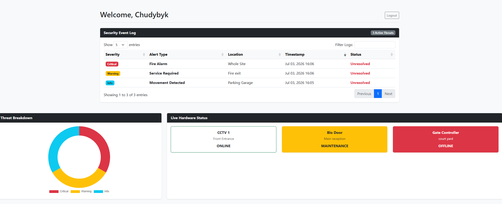

# MATRIX Enterprise Client Operations Portal & IoT Telemetry Gateway

A secure, full-stack web application designed for enterprise security clients. This system provides a central operations center for monitoring live physical hardware status via a dedicated REST API, tracking support tickets, generating automated email reports, and analyzing active network threats.

## Project Overview

This Proof of Concept (PoC) was built to demonstrate a modern, scalable client dashboard for the security sector. It moves away from static reporting and provides clients with a real-time, machine-to-machine Operations Center interface.

### **Key Features:**
* **RESTful Telemetry API:** Secure endpoint (`/api/device-ping/`) designed to ingest live JSON payloads from external hardware nodes (CCTV, Switches, Climate Sensors) and instantly sync to the database.
* **Google Single Sign-On (SSO):** Enterprise-grade authentication using OAuth 2.0 via `django-allauth`.
* **Interactive Data Grids:** Asynchronous, client-side asset tracking powered by `DataTables.js`, allowing instant pagination, sorting, and search filtering without page reloads.
* **Threat & Infrastructure Analytics:** Interactive Pie and Doughnut charts built with `Chart.js` to dynamically break down active security alerts by severity (Critical, Warning, Info) and device status distributions.
* **Automated Email Reporting:** Integrated SMTP email engine (`send_report.py`) capable of compiling dashboard metrics and firing automated performance or critical alert logs directly to stakeholder inboxes.
* **Enterprise Admin Console:** A sleek, custom dark-themed administrative backend powered by Django `Jazzmin` for streamlined multi-tenant management.

---

## Technology Stack

* **Backend:** Python 3, Django 5.x
* **Database:** SQLite (Development) / Ready for PostgreSQL (Production)
* **Authentication:** Django-Allauth (Google Provider / JWT)
* **Frontend:** HTML5, Bootstrap 5, Chart.js, DataTables.js
* **API Ingestion & Services:** Native Django JSON parsing with CSRF exemption for automated hardware nodes, Django Core Mail SMTP backend.

---

## Dashboard Preview



---

## Core Architecture

The database is built on highly relational Django models to link users directly to their localized security infrastructure:

* `DeviceHealth`: Monitors individual IoT and security hardware across multiple warehouse and office locations, updating dynamically via API.
* `SecurityAlert`: Logs physical and digital breaches with timestamps and resolution tracking.
* `ClientOutcome`: Tracks overall project health and system uptime metrics.

---

## API Integration: Hardware Ping Simulator

External network devices synchronize with the database by firing a POST request to the API gateway.

**Endpoint:** `POST /api/device-ping/`

**Example JSON Payload:**
```json
{
  "device_id": 1,
  "status": "ONLINE",
  "firmware_version": "v4.2.1",
  "telemetry": {
    "cpu_usage_percent": 14.5,
    "uptime_hours": 128
  }
}