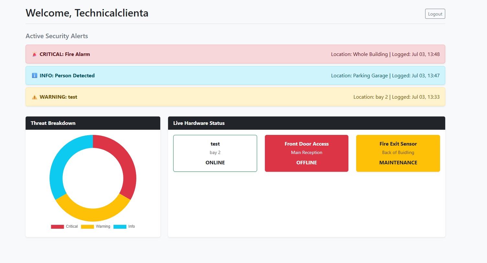

# SECOM Enterprise Client Operations Portal

A secure, full-stack web application designed for enterprise security clients to monitor live hardware status, track support tickets, and analyze active network/physical threats.

## Project Overview

This Proof of Concept (PoC) was built to demonstrate a modern, scalable client dashboard for the security sector. It moves away from static reporting and provides clients with a real-time Operations Center interface.

**Key Features:**
* **Google Single Sign-On (SSO):** Enterprise-grade authentication using OAuth 2.0 via `django-allauth`.
* **Live Hardware Status Grid:** Real-time visualization of site-wide devices (CCTV, Access Control, Firewalls) with automated color-coded health indicators.
* **Threat Analytics:** Interactive Doughnut chart built with `Chart.js` to break down active security alerts by severity (Critical, Warning, Info).
* **Support Metric Tracking:** Data tables tracking system uptime, project health, and monthly resolved IT/Security tickets.

## Technology Stack

* **Backend:** Python, Django 5.x
* **Database:** SQLite (Development) / Ready for PostgreSQL (Production)
* **Authentication:** Django-Allauth (Google Provider / JWT)
* **Frontend:** HTML5, Bootstrap 5, Chart.js

## Dashboard Preview

## Core Architecture

The database is built on highly relational Django models to link users directly to their localized security infrastructure:

* `ClientOutcome`: Tracks overall project health and uptime metrics.
* `SecurityAlert`: Logs physical and digital breaches with timestamps and resolution tracking.
* `DeviceHealth`: Monitors individual IoT and security hardware across multiple warehouse and office locations.

## Security Implementations

* Isolated Python Virtual Environments for dependency management.
* Cryptography libraries deployed for secure token handling.
* Protected routes utilizing Django's `@login_required` decorators.
* Environment variables abstracted for sensitive Client IDs and Secret Keys.